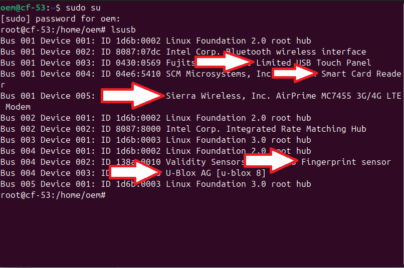

---
# Ubuntu Installation & Configuration For ToughBooks
---

Recommended Ubuntu Versions by Model
---
When preparing to install or use an operating system, it's crucial to consider the version based on the specific hardware you intend to use. Different machine models often perform optimally with particular operating system releases.

**NOTE:**
The following table displays various units models and the corresponding **Ubuntu versions** that are recommendedn for their **correct and optimal functioning.**

 | Model | Ubuntu Version |
   |:-----:|:------|
   | CF-53 MK  |  Ubuntu **24.04** LTS (Noble Numbat)  |
   | CF-54 MK2  |  Ubuntu **24.04** LTS (Noble Numbat)  |
   | FZ-G1 MK1 | Ubuntu **20.04** LTS (Focal Fossa) |
   | FZ-G1 MK4 | Ubuntu **22.04** LTS (Jammy Jellyfish) |


---
Installation Guide
---
1. Boot from the USB drive
---
**NOTE:**
In case you are installing **Ubuntu 22.04 or an earlier version**, select the option **'Install OEM only for manufacturers'** instead of just 'Install Ubuntu.' This will enable the Sysprep (System Preparation) process.

---
Choose the language and keyboard layout

3. Connect to a network: It is recommended to connect to the internet during installation. **This allows the installer to download updates and third-party drivers**
4. Select the Installation type: Enable third-party drivers.
5. Create user account **with the following credentials**:\
   It is important to use these credentials because when performing a **factory reset (sysprep)**, the system needs to identify a user named **'oem'**; otherwise, the reset will fail.
   | <!--> | <!--> |
   |:-----:|:------|
   | Name  |  oem  |
   | user  |  oem  |
   | password | 1234 |

6. Begin the Installation
7. Restart

---
# Auto-Install Script 
---
This Script automates the process of **scanning detected devices, installing the necessary drivers and packages** for testing, and performing an **OEM reset (Sysprep)**. 

---
**NOTE:**
While the script streamlines these tasks, it’s still highly recommended to manually test each device to verify its proper function.

---
### Clone the repository
1. Make sure you are connected to Wi-Fi
```bash
 cd Downloads
 sudo apt install git –y #(in case that you did not install before)
 git clone https://github.com/AndresVGu/toughbook-autoinstall
 cd Toughbook-autoinstall
 chmod +x autoinstall.sh #gives execution permission to the script
 ./autoinstall.sh #executes the script
```
# Ubuntu configuration

1. Connect to Wi-fi
2. Open the ubuntu terminal ( Super + terminal) and perform the following commands as **root**:\
   Use the password for this case **&rarr; 1234**
```bash
sudo su  
sudo apt update -y && sudo apt upgrade -y
sudo apt install git -y
```
3.Check drives (Super + Software & updates)
Go to Additional drivers tab and make sure that says **“No additional drivers available”**


How to Check Your Connected Devices: 
---
This method will show you how to check if the computer is detecting connected devices such as Webcam, 4G Modem, GPSd, Fingerprint, Touch Screen, or Smart Card Reader
Open the terminal and use the following commands

```bash
lsusb
```
If you do not see the device required in the list: This means the computer has not detected. This could be because the device is not working properly, it is not compatible, or it is not properly connected.



How to Test Bluetooth & Wi-Fi:
---
To test the Wi-Fi and Bluetooth, you don’t need to use the terminal. You can use the UI.

**Settings &rarr; Networks or Bluetooth**

How to Set Up and Test the 4G Modem:
---
Most of the time the **Sierra Wireless EM7455 Modem** works on Ubuntu 24.0, these devices are automatically detected and should work with the built-in drivers. However, you need to configurate the Access Point Name (APN) to connect your mobile data network.

1. Insert the SIM Card: You will not see the **“Mobile Network Configuration”** option in the UI until a SIM Card is detected.
2. Go to Mobile Network Settings and configure the APN: Access Point Names &rarr; add new APN and you will need to fill these fields:
   
   | <!--> | <!--> |
   |:-----:|:------|
   | Name  |  internet |
   | APN  |  sp.telus.com  |

(remember you need to use the APN for the data provider) 


3. Save changes and make sure to select this APN as the default
   
4. Activate the Mobile data & Test:
   
```bash
ping 8.8.8.8
```

How to Test GPS dedicated:
---
To test the GPS module, you will use a service called gpsd and its related tools.  This service manages data from the GPS receiver and makes it available for other applications.

1. Install gpsd and its tools: use the following commands:

```bash
sudo apt install gpsd gpsd-clients -y
```

2. Verify the GPS connection
```bash
lsusb | grep “U-Blox”
```
you will see the name of the device U-Blox AG [u-blox 8]

3. Run GPS test with the following commands:

```bash
cgps #with this command you will see the data in console (text-based)
xgps #is a visual tool that shows the same information
```
It can take a few minutes to get a “fix” on the satellites.


---
**NOTE**

If the applications don’t show any data, it might be because you are in a space where the GPS doesn’t detect the satellites, or a problem with the gpsd service. You can check its status with:

```bash
sudo systemctl status gpsd
```
--- 
WebCam Configuration: 
---
The Camera is usually detected and ready to go automatically. All you need to do is install a simple application to test it
```bash
sudo apt install cheese
sudo apt -y install kamoso
```
---
**NOTE:**
On some units, such as **DELL devices**, the application CHEESE may present errors or bugs. For this reason, instead of using Cheese, we will use KAMOSO

```bash
sudo apt remove cheese
```
---
How to Calibrate the Touch Screen:
---
You can calibrate the touchscreen using a command-line tool called xinput-calibrator. This tool is effective when you’re using the X Window System, which is the default display server on Ubuntu.

1. Install xinput-calibrator
```bash
sudo apt install xinput-calibrator
```
2. Run the Calibrator
Run the calibrator from the terminal. This will launch a simple graphical interface.
```bash
xinput_calibrator
```


### Make the calibration permanent:

After tapped all four points in the UI, the terminal will show the calibration data as a **“snippet”**. This snippet contains the values needed to make the calibration persistent across reboots.

1. Run the calibrator 
2. Copy the entire output from the terminal (ctrl + shift + c), and replace the name of the specific touch device 
```bash
sudo nano /etc/X11/xorg.conf.d/99-calibration.conf
#Paste the snippet into this file (ctrl + s) => save, (ctrl + x) => exit
reboot now
```
### In case xinput_calibrator doesn't work 
1. log out and use the **Gnome Xorg** option in the authentication panel
2. open the terminal and authenticate as root
3. go to **/usr/local/bin** directory\
4. Create a bash script with the following content (the values of the coordinate transformation Matrix may vary depending the unit)

```bash
#!/bin/sh

#Coordinate touch panel to screen
#representations:
#Touch_area_width,0,touch_x_offset,0,touch_area_height,touch_y_offset,0,0,1
xinput set-prop "Fujitsu Component USB Touch Panel" --type=float "Coordinate Transformation Matrix" 1.115 0 -0.0709 0 1.14 -0.108 0 0 1
```
5. save and give execution permisions.
6. then set up this script in the auto execute panel 

How to Set up the Fingerprint Sensor:
---
To test your fingerprint sensor, you will use a command-line tool called fprintd
1. Install fprintd
```bash
sudo apt install fprintd
```
2. Enroll a Fingerprint: If the sensor is detected, you can use fprintd to enroll a fingerprint.
```bash
fprintd-enroll #Follow the onscreen instructions, you’ll see a success message
fprint-verify
```
How to set up the Smart Card Reader: 
---
To test the smart card reader, you can use command-line tools from pcsc-tools or opensc
1. Install the tools:
```bash
sudo apt install pcscd pcsc-tools
```
### Check is the Reader is detected
```bash
pscc_scan
```
The command will tell you if a reader is detected. Look for a line that says “Reader 0: <reader_name>…”. This means the system
recognizes the reader.
### Test with a card
1. Insert the smart card
```bash
pcsc_scan
```
The command will provide information about the card

Configure Computer Fan and Temperature:
---
---
**NOTE:**
This step is only necessary if a unit failure is noticed when making the order or if it is specifically required.

---
To diagnose a fan, you can use command-line tools to monitor your CPU temperature and fan speed.

### Monitor CPU temperature: 

1. Install lm-sensors
```bash
sudo apt install lm-sensors
```
After installing, run the following command to have the system find all your hardware sensors. Press Enter at each question to accept the default options
```bash
sudo sensors-detect
sersors
```
With sensors command you can see the temperature of your CPU,GPU, and other parts.
Monitor Fan Speed: you can use **lm-sensors** along with fancontrol

2. Install fancontrol:
```bash
sudo apt install fancontrol
```
3. Configure fancontrol:
```bash
Sudo pwmconfig
```
Follow the on-screen instructions to test the fans. This will show you the current speed in RPM

Delete Test Profile and Prepare unit: 
---
---
**NOTE:**
In case you are using Ubuntu 22.04, it is not necessary to perform this step, as there is a program embedded in the desktop.

---
To prepare the device for distribution as an (OEM) Original Equipment Manufacturer use the following commands:

1. Update and Upgrade the System:
```bash
sudo apt update && sudo apt full-upgrade -y
```
2. Install OEM packages:
```bash
sudo apt install -y oem-config-gtk oem-config-slideshow-ubuntu
```
3.Prepare the System for the End-User:

This is the most critical step. The oem-config-prepare command cleans up the system and sets it to a state where end-user can create their own account
```bash
sudo oem-config-prepare
```

4. Shutdown the device
```bash
sudo shutdown -h now
```


